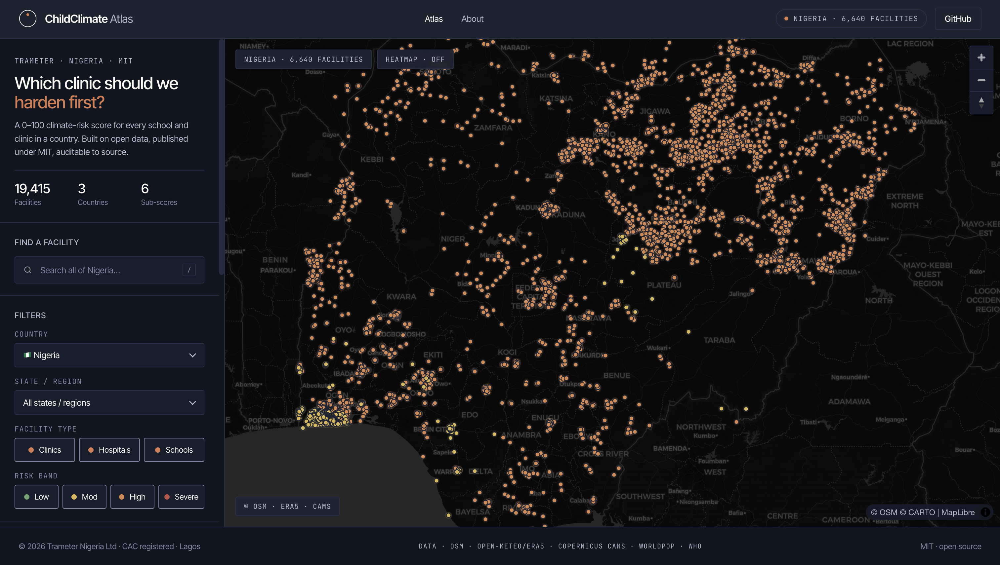

# ChildClimate Risk Atlas

**Facility-level climate & health vulnerability scores for schools and clinics, anywhere in the world.**

An open-source pipeline that turns open climate, air-quality, and geospatial data into a prioritised action list for protecting children from climate hazards.

[](./LICENSE)

[](http://climate-atlas.trameter.com/)

## 🌍 Try it live

The Atlas is running at **[climate-atlas.trameter.com](http://climate-atlas.trameter.com/)** — no install required. Switch between Nigeria, Bangladesh, and Guatemala; filter by state, facility type, or risk band; click any clinic or school to see its risk breakdown and recommended actions.

[](http://climate-atlas.trameter.com/)

<sub>Nigeria — 6,446 schools and clinics scored at a national view. Pick a country, narrow by state or facility type, and click any dot to open its risk breakdown and recommended actions.</sub>

---

## What it does

For every health clinic and school in a target country, the Atlas computes a **0–100 Child Climate Risk Score** that answers one question:

> *How dangerous is the climate becoming for the children who rely on this facility?*

The score combines four layers:

1. **Climate hazard exposure** — heat, flood, drought, air pollution (PM2.5, NO₂), wildfire smoke
2. **Child population density** — how many kids this facility serves
3. **Facility fragility** — power, water, structure, backup capacity
4. **Service access** — distance to the next facility, road quality, mobile coverage

Output: an interactive web map where a health minister, UNICEF country officer, programme manager, or NGO can click any clinic or school and instantly see its risk breakdown and top recommended actions.

## Why it exists

Most climate vulnerability assessments stop at the country or district level. But money gets spent on specific buildings, not countries. This tool pushes vulnerability scoring down to the **facility level**, so the same question — *"which clinic should we fix first?"* — has a data-backed answer anywhere in the world.

## Positioning

| Adjacent tools | What the Atlas adds |
|---|---|
| WHO AIR Q, IQAir | Facility-level resolution + child-weighted, not just air |
| ThinkHazard! (World Bank) | District → building-level zoom |
| INFORM Risk Index | Facility-level + child-population weighting |
| UNICEF CCRI and similar country-level indices | Extends the same methodology from country → facility |
| Healthsites.io / OpenStreetMap | Adds a risk layer on top of the facility registry |

## Swap countries with one line

```python
COUNTRY = "NGA"  # Nigeria
# COUNTRY = "BGD"  # Bangladesh
# COUNTRY = "GTM"  # Guatemala
```

…and the same pipeline produces the same output for any country worldwide.

## Quick start

```bash
git clone https://github.com/Trameter/childclimate-atlas.git
cd childclimate-atlas
python3 -m venv .venv && source .venv/bin/activate
pip install -r requirements.txt

# Build the atlas for Nigeria
python3 -m pipeline.build --country NGA

# Open the map
open web/index.html
```

## Data sources

| Layer | Source | Licence |
|---|---|---|
| Health facilities | [Healthsites.io](https://healthsites.io) / OSM | ODbL |
| Schools | [GIGA](https://projectconnect.unicef.org) / OSM | ODbL |
| Heat, flood, drought | [Open-Meteo](https://open-meteo.com) / ERA5 | CC-BY |
| Air quality (PM2.5, NO₂) | [Sentinel-5P](https://sentinel.esa.int) via Copernicus | Open |
| Child population | [WorldPop](https://www.worldpop.org) | CC-BY |
| Roads / access | [OpenStreetMap](https://www.openstreetmap.org) | ODbL |

## Architecture

```
childclimate-atlas/
├── pipeline/          # Python data pipeline (country-agnostic)
│   ├── sources/       # One module per data source
│   ├── scoring/       # Vulnerability scoring model
│   └── build.py       # Orchestrator: pulls → scores → exports GeoJSON
├── config/            # Country configs (NGA.yaml, BGD.yaml, ...)
├── data/              # Raw + processed outputs (gitignored)
├── web/               # Static MapLibre frontend
└── docs/              # Methodology and scoring weights
```

## Licence

MIT — use it, fork it, run it for your country, improve it.

## Status

**Prototype.** Nigeria is the first polished demo; Bangladesh and Guatemala follow. Contributions welcome — see [CONTRIBUTING.md](./CONTRIBUTING.md).

---

A [Trameter](https://github.com/Trameter) project.
