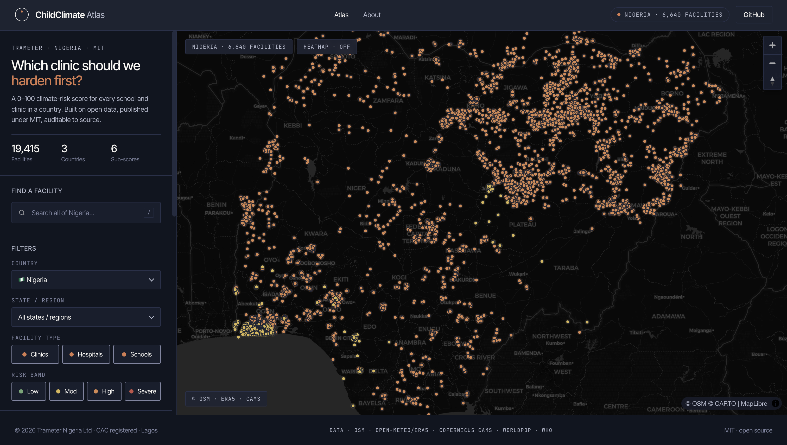
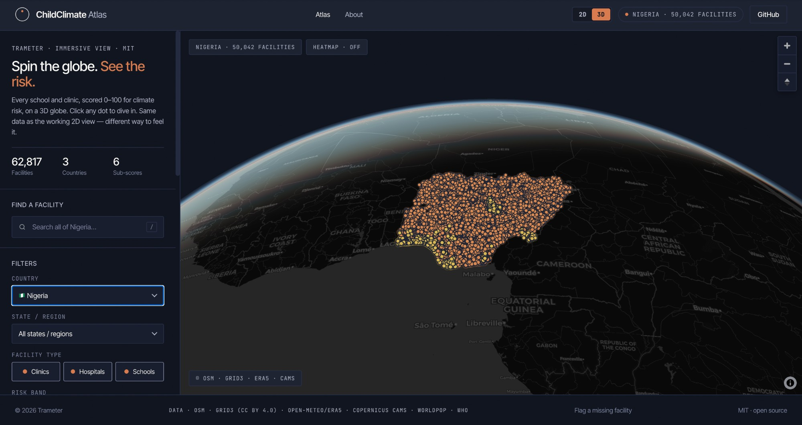

# ChildClimate Risk Atlas

**Facility-level climate & health vulnerability scores for schools and clinics, anywhere in the world.**

An open-source pipeline that turns open climate, air-quality, and geospatial data into a prioritised action list for protecting children from climate hazards.

[](./LICENSE)

[](http://climate-atlas.trameter.com/)

## 🌍 Try it live

The Atlas is running at **[climate-atlas.trameter.com](http://climate-atlas.trameter.com/)** — no install required. Switch between Nigeria, Bangladesh, Guatemala, Kenya, and the Philippines; filter by state, facility type, or risk band; click any clinic or school to see its risk breakdown and recommended actions.

### Two views, same data

**[Working dashboard → climate-atlas.trameter.com](http://climate-atlas.trameter.com/)** — data-dense 2D map for ministries, researchers, and journalists.

[](http://climate-atlas.trameter.com/)

**[Immersive globe → climate-atlas.trameter.com/3d](http://climate-atlas.trameter.com/3d)** — the same 311,669 facilities on a tilted 3D globe with cinematic camera and pulsing rings around the most-critical sites. For storytelling, outreach, and decision-maker briefings.

[](http://climate-atlas.trameter.com/3d)

<sub>311,669 schools and clinics across Nigeria, Bangladesh, Guatemala, Kenya, and the Philippines. Click any dot in either view to open its risk breakdown and recommended actions. Toggle between views from the top-right at any time — filters and selection are preserved.</sub>

---

## What it does

For every health clinic and school in a target country, the Atlas computes a **0–100 Child Climate Risk Score** that answers one question:

> *How dangerous is the climate becoming for the children who rely on this facility?*

The score combines four layers:

1. **Climate hazard exposure** — heat, flood, drought, air pollution (PM2.5, NO₂), wildfire smoke
2. **Child population density** — how many kids this facility serves
3. **Facility fragility** — power, water, structure, backup capacity
4. **Service access** — distance to the next facility, road quality, mobile coverage

Output: an interactive web map where a health minister, UNICEF country officer, programme manager, or NGO can click any clinic or school and instantly see its risk breakdown and top recommended actions.

## Why it exists

Most climate vulnerability assessments stop at the country or district level. But money gets spent on specific buildings, not countries. This tool pushes vulnerability scoring down to the **facility level**, so the same question — *"which clinic should we fix first?"* — has a data-backed answer anywhere in the world.

## Positioning

| Adjacent tools | What the Atlas adds |
|---|---|
| WHO AIR Q, IQAir | Facility-level resolution + child-weighted, not just air |
| ThinkHazard! (World Bank) | District → building-level zoom |
| INFORM Risk Index | Facility-level + child-population weighting |
| UNICEF CCRI and similar country-level indices | Extends the same methodology from country → facility |
| Healthsites.io / OpenStreetMap | Adds a risk layer on top of the facility registry |

## Swap countries with one line

```bash
python3 -m pipeline.build --country NGA   # Nigeria      (159,004 facilities, heat-dominant)
python3 -m pipeline.build --country BGD   # Bangladesh   ( 16,022 facilities, flood-dominant)
python3 -m pipeline.build --country GTM   # Guatemala    ( 29,001 facilities, heat + Dry Corridor)
python3 -m pipeline.build --country KEN   # Kenya        ( 41,438 facilities, drought + ASAL heat)
python3 -m pipeline.build --country PHL   # Philippines  ( 66,204 facilities, typhoons + monsoon)
```

…and the same pipeline produces the same output for any country worldwide. Each country's scoring weights are tuned in `config/{ISO}.yaml` to reflect its dominant hazard profile (Sahel heat for NGA, Bay of Bengal floods for BGD, Pacific lowlands + Dry Corridor for GTM, ASAL drought + heat for KEN, typhoons + monsoon for PHL).

## Quick start

```bash
git clone https://github.com/Trameter/childclimate-atlas.git
cd childclimate-atlas
python3 -m venv .venv && source .venv/bin/activate
pip install -r requirements.txt

# Build the atlas for Nigeria
python3 -m pipeline.build --country NGA

# Open the map
open web/index.html
```

## Data sources

| Layer | Source | Licence |
|---|---|---|
| Schools + clinics (primary) | [OpenStreetMap](https://www.openstreetmap.org) via Overpass (amenity + healthcare schemas) | ODbL |
| Health facilities (supplementary) | [Healthsites.io](https://healthsites.io) global bulk shapefile (1.28M facilities worldwide; sliced per-country at build time) | ODbL |
| Schools (supplementary) | [GIGA](https://giga.global/) UNICEF + ITU school registry (177K schools across 5 countries; bulk CSV downloads from maps.giga.global) | CC BY 4.0 |
| Health facilities (Nigeria-specific) | [GRID3 NGA Health Facilities v2.0](https://doi.org/10.7916/kv1n-0743) (CIESIN / Columbia University, incorporates NHFR 2024) | CC BY 4.0 |
| Heat, flood, drought | [Open-Meteo](https://open-meteo.com) ERA5 archive (daily heat-index, precipitation, dry-run days) | CC-BY |
| Air quality (PM2.5, NO₂) | [Open-Meteo Air Quality](https://open-meteo.com/en/docs/air-quality-api) (CAMS) | CC-BY |
| Country borders (VR globe) | [Natural Earth 1:50m admin-0](https://www.naturalearthdata.com/) | Public domain |
| Country admin filter | [reverse_geocoder](https://github.com/thampiman/reverse-geocoder) | LGPL |

**Nigeria facilities cite:** Center for Integrated Earth System Information (CIESIN), Columbia University. 2024. *GRID3 NGA — Health Facilities v2.0*. New York: GRID3. [https://doi.org/10.7916/kv1n-0743](https://doi.org/10.7916/kv1n-0743).

### Healthsites.io bulk integration

The Healthsites.io API free tier is 50 requests/day — infeasible for countries with 8K+ facilities (Nigeria needs ~100 paginated calls alone). Instead, we download their full global shapefile once (4.2 GB, both `World-node` + `World-way` layers) and slice it per-country at build time via `scripts/healthsites_bulk_slice.py`. Single 31-second pass through ~1.28M global records produces per-country JSON caches used by the pipeline. New countries are sliced in seconds, no API rate-limit gymnastics.

## Architecture

```
childclimate-atlas/
├── pipeline/          # Python data pipeline (country-agnostic)
│   ├── sources/       # One module per data source
│   ├── scoring/       # Vulnerability scoring model
│   └── build.py       # Orchestrator: pulls → scores → exports GeoJSON
├── config/            # Country configs (NGA.yaml, BGD.yaml, ...)
├── data/              # Raw + processed outputs (gitignored)
├── web/               # Static MapLibre frontend
└── docs/              # Methodology and scoring weights
```

## Licence

MIT — use it, fork it, run it for your country, improve it.

## Status

**Prototype — v0.7.** Five countries shipped (Nigeria, Bangladesh, Guatemala, Kenya, Philippines), 311,669 facilities scored, three viewing modes (2D dashboard, 3D globe, WebXR VR). Methodology tightens as we onboard more countries.

**Climate data (v0.7):** ERA5 bulk downloads from Copernicus CDS, multi-year averaged (2024 + 2025) per facility. This sidesteps Open-Meteo's archive API rate-limit dependency entirely AND smooths out single-year climate variability (e.g. 2025's La Niña understated drought in tropical Pacific countries). Heat-index is computed indoors via NOAA Rothfusz from T + dewpoint — more relevant for child welfare since kids spend most of the day in classrooms, not direct sun.

**Concentration-bonus scoring (v0.6):** `score = 100 * (weighted_sum + 0.10 * max_hazard * (max_hazard - mean_hazard))`. Surfaces facilities where ONE hazard is extreme even if others aren't. Without this, Kenya's ASAL counties (270+ heat-index days/yr) would be capped at ~70 by the pure additive model and never reach SEVERE despite being unmistakably extreme on the hazards that actually apply. The bonus is small when hazards are evenly elevated (broadly-high sites) and large when one hazard dominates.

Contributions welcome — see [CONTRIBUTING.md](./CONTRIBUTING.md).

---

A [Trameter](https://github.com/Trameter) project.
